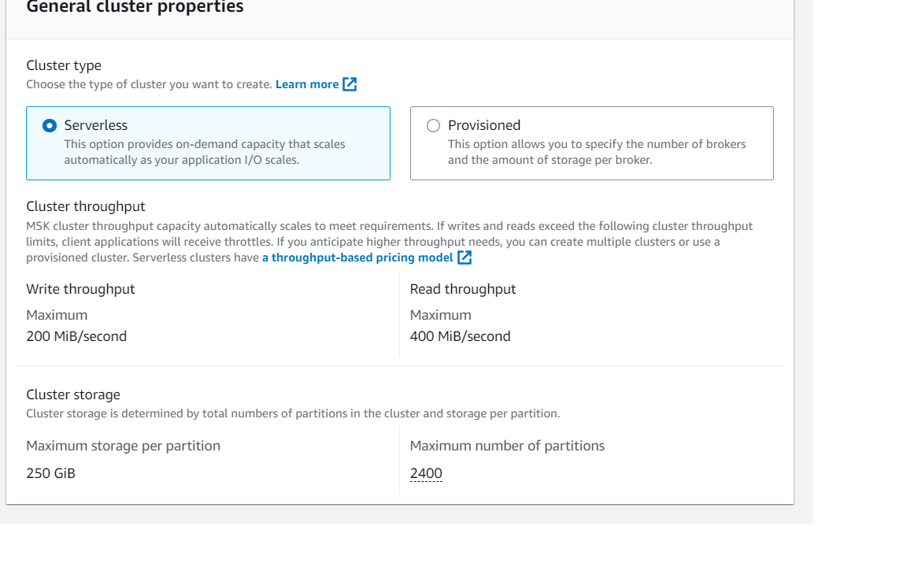
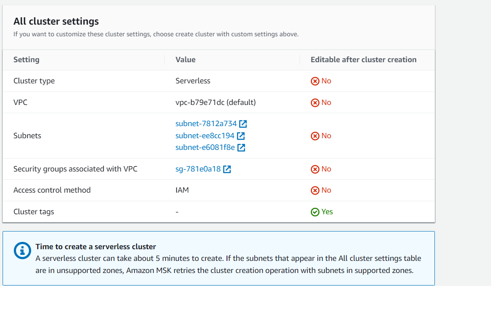
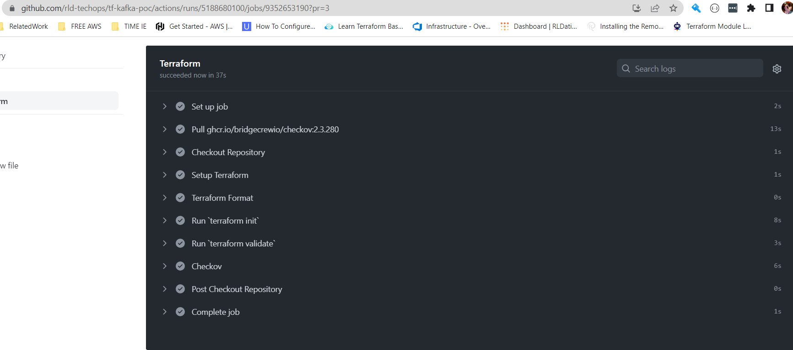

# AWS Managed Kafka - MSK

## What is in the code

-rw-r--r-- 1 RLDATIX+Ilija.Dimitrov 4096   438 May 31 14:54 00_config.auto.tfvars

-rw-r--r-- 1 RLDATIX+Ilija.Dimitrov 4096   327 May 31 12:39 00_provider.tf

-rw-r--r-- 1 RLDATIX+Ilija.Dimitrov 4096   900 Jun  5 06:52 01_variables.tf

-rw-r--r-- 1 RLDATIX+Ilija.Dimitrov 4096   937 Jun  5 06:51 10_sg_for_kafka_cluster.tf

-rw-r--r-- 1 RLDATIX+Ilija.Dimitrov 4096  1252 Jun  5 10:17 11_iam_policy_for_kafka.tf

-rw-r--r-- 1 RLDATIX+Ilija.Dimitrov 4096  2495 Jun  5 11:07 12_iam_server_role_with_kafka_policy.tf

-rw-r--r-- 1 RLDATIX+Ilija.Dimitrov 4096   866 Jun  5 11:18 13_MSK_auto_scale_storage.tf

-rw-r--r-- 1 RLDATIX+Ilija.Dimitrov 4096   145 Jun  5 05:59 14_MSK_log_group.tf

-rw-r--r-- 1 RLDATIX+Ilija.Dimitrov 4096   522 Jun  5 06:33 15_msk_configuration.tf

-rw-r--r-- 1 RLDATIX+Ilija.Dimitrov 4096  1513 Jun  5 11:18 30_MSK_Provisioned.tf

-rw-r--r-- 1 RLDATIX+Ilija.Dimitrov 4096   435 Jun  5 08:29 40_MSK_Serverless.tfx

-rw-r--r-- 1 RLDATIX+Ilija.Dimitrov 4096 24466 Jun  5 11:52 terraform.tfstate

-rw-r--r-- 1 RLDATIX+Ilija.Dimitrov 4096 10118 Jun  5 11:18 terraform.tfstate.backup


Assamptions during making the code:
- For test we will need only one Cluster. If in future more clusters are needed this need to be changed into a module.
- Code for two types of MSK is developed: Provisioned and Serverless. Both need to be tested and with that feedback to decide how to proceed. Not much can change with Serverless type. Provisioned brings variety but we need info for proper settings. For now, default settings are used.
```
Settings for Provisioned Cluster:
- Recommended version for Kafka is 2.8.1
- Broker Type (recommended kafka.m5.large) used kafka.t3.small (for these instance type we have notification that supports up to 300 partitions per broker when you use kafka.t3.small. If you need more partitions per broker, use M5 broker types.). Also, when on m5 instance type we have the opportunity to set provisioned throughput. Here provision throughput is disable by default.
- Number of Zones - recommended 3 but will need to know where to deploy and the number of zones
- Brokers per zone 1
- Storage - recommended 1000G per broker set to 10G
- EBS storage only
- Configuration parameters (using default settings)
		auto.create.topics.enable=false
		default.replication.factor=3
		min.insync.replicas=2
		num.io.threads=8
		num.network.threads=5
		num.partitions=1
		num.replica.fetchers=2
		replica.lag.time.max.ms=30000
		socket.receive.buffer.bytes=102400
		socket.request.max.bytes=104857600
		socket.send.buffer.bytes=102400
		unclean.leader.election.enable=true
		zookeeper.session.timeout.ms=18000
- Networking - using existing VPC. We need feedback on how to set up the cluster. Does it need to have public access or not. Recommended not to have public access and the cluster should be in the same VPC as the AAPP servers. Public access to MSK is not enabled.
- Security Groups - who need access. Access is allowed by instance SG accessing the server. Now is open for any access from APP side. Works on TCP port 9098.During test to be changed to accept access only from this port.
- IAM access to server. IAM based policy access is defined. Policy is created and role to add the policy is created. On Production account attached policies need to be added as needed for the instances.
- TLS encryption is enabled by default.
- Monitoring is set to basic.
- Monitoring with Prometheus is enabled but not tested.
- Logs are pushed to CloudWatch. Possibility to have them on S3. Needs retention period to be set (currently is 14 days).
- Auto Scaling for Storage is created. Needs changing values as product needs.
```

```
Settings for Serverless Cluster:
À that is permitted to set is the IAM access, SG and Subnets where to deploy.
What we get from Serverless see image.
```



According to feedback from Dev on requirement we can change the settings as needed.

### Terraform Global Configuration

Files:
- 00_config.auto.tfvars
Need values for subnets, region and VPC. Further to be set and get the values with DATA.
- 00_provider.tf
Set to local repo. Once migrated to TF Cloud needs to be accordingly changed.
- 01_variables.tf
Definition for all needed variables so the code can work.

### Terraform Resorcece

- 10_sg_for_kafka_cluster.tf 
Security group. Access is filtered by source instance SG.
- 11_iam_policy_for_kafka.tf 
Policy to allow instances to access Kafka Cluster. The policy needs to be added to the existing instance Role.
- 12_iam_server_role_with_kafka_policy.tf
Instance role containing needed policy is created. This needs to be set according to Time 247 policy requirements for access.
- 13_MSK_auto_scale_storage.tf
Scaling Group set to 70% usage.
- 14_MSK_log_group.tf
Log group is created where logs will be pushed. Retention period is 14 days.
- 15_msk_configuration.tf
Conf file with concrete settings how the cluster should behave. Needs to be updated according to Dev requests.


### Main Configuration Provisioned Cluster
- 30_MSK_Provisioned.tf
MSK provisioned cluster configuration.

### Main Configuration Serverless Cluster
- 40_MSK_Serverless.tf
MSK Serverless Cluster Configuration.


## Installing Server to test

Creation of EC2 instance to manage the cluster is not done by Terraform. If needed can be created and installed so we can create the Topics, but we expect that this will be handled by the APP.

For test purposes Linux 2 EC2 instance was created.

Installation steps:


```
sudo yum -y install java-11
wget https://archive.apache.org/dist/kafka/2.8.1/kafka_2.13-2.8.1.tgz
tar -xzf kafka_2.13-2.8.1.tgz
wget https://github.com/aws/aws-msk-iam-auth/releases/download/v1.1.1/aws-msk-iam-auth-1.1.1-all.jar

cd kafka_2.13-2.8.1/bin
vim client.properties
    ecurity.protocol=SASL_SSL
    asl.mechanism=AWS_MSK_IAM
    asl.jaas.config=software.amazon.msk.auth.iam.IAMLoginModule required;
    asl.client.callback.handler.class=software.amazon.msk.auth.iam.IAMClientCallbackHandler

From the MSK get the broker endpoint. One is enough.

Command to create Topic:

 ./kafka-topics.sh --create --bootstrap-server b-2.sysopsmsktest.a2w4xb.c4.kafka.us-east-2.amazonaws.com:9098 --replication-factor 3 --partitions 1 --topic MSKTutorialTopic --command-config client.properties

Command for the Producer:

  ./kafka-console-producer.sh --broker-list b-2.sysopsmsktest.a2w4xb.c4.kafka.us-east-2.amazonaws.com:9098 --producer.config client.properties --topic MSKTutorialTopic

Command for the Consumer:

/kafka-console-consumer.sh --bootstrap-server b-2.sysopsmsktest.a2w4xb.c4.kafka.us-east-2.amazonaws.com:9098 --consumer.config client.properties --topic MSKTutorialTopic --from-beginning

```

And it works. :)

This is being saved in Terraform State:
```
$ terraform.exe state list
aws_appautoscaling_policy.kafka_broker_scaling_policy
aws_appautoscaling_target.kafka_storage
aws_cloudwatch_log_group.MSKLogs
aws_iam_instance_profile.EC2_Default_IAM_Role1
aws_iam_policy.IAMSysOpsMSKPolicy
aws_iam_role.EC2_Default_IAM_Role1
aws_iam_role_policy_attachment.AWSBackupFullAccess_attachment
aws_iam_role_policy_attachment.AWSBackupServiceRolePolicyForBackup_attachment
aws_iam_role_policy_attachment.AWSBackupServiceRolePolicyForRestores_attachment
aws_iam_role_policy_attachment.AmazonEC2RoleforSSM_attachment
aws_iam_role_policy_attachment.AmazonS3FullAccess_attachment
aws_iam_role_policy_attachment.AmazonSSMMaintenanceWindowRole_attachment
aws_iam_role_policy_attachment.CloudWatchAgentAdminPolicy_attachment
aws_iam_role_policy_attachment.CloudWatchAgentServerPolicy_attachment
aws_iam_role_policy_attachment.IAMSysOpsMSKPolicy_attachment
aws_msk_cluster.Time247MSK
aws_msk_configuration.MSKConfig
aws_msk_serverless_cluster.MSK247Serverless
aws_security_group.kafka

RLDATIX+Ilija.Dimitrov@SKP-L3617 MINGW64 ~
```

When destroying the Provisioned Cluster you mast destroy also 13_MSK_auto_scale_storage.tf.

## GIT Action

Code is in GIT and GIT Actions were implemented.



At start Git Action reported few best practices improvements:
- retention of logs to be gt 1 year (set to 400 days)
- KMS encryption for logs (creating KMS Key)
- KMS encryption for Kafka (creating KMS key)


## Test Deployment

On the meeting was agreed to continue with Serverless Kafka. The code is used - 247Time. A new branch was created and in terraform product for Test 247 Time was set to point to the new Branch.
Branch Name: main_testing (not to be merged).
Git Repo: url = https://github.com/rld-techops/tf-247.git  -  use for test branch  -  "main_testing"
Terraform Repo: https://app.terraform.io/app/allocatesoftware/workspaces/techops-247-testing
What has been added:
in TF/  --- kafka_247time.tf (SG and Serverless Kafka is set).
```
resource "aws_msk_serverless_cluster" "kafka247timetesting" {    #kafka247timetesting need changing
  cluster_name = "EW1T24TIMEK01"    #EW1T24TIMEK01 needs changing

  vpc_config {
    subnet_ids         = ["subnet-0dc2574e3bfeb9fbe", "subnet-09ed5137b5f2cf38d"]    #   if needed change the subnets
    security_group_ids = [aws_security_group.kafka.id]
  }

  client_authentication {
    sasl {
      iam {
        enabled = true
      }
    }
  }
  tags = {
    Name          = "EW1T24TIMEK01-Kafka"     # need changing
    TeamEmail     = "TechOps@allocatesoftware.com"
    TerraformRepo = "https://github.com/asw-techops/tf-247time"
    ManagedBy     = "Terraform"
    Description   = "Managed Kafka"
    Environment   = "Test"
    CostCentre    = "247time"
    Product       = "247time"
  }

}


resource "aws_security_group" "kafka" {      # need changing
  description = "Access to managed Kafka"
  vpc_id      = var.vpc_id
  ingress {
    from_port   = 0
    to_port     = 0
    protocol    = "-1"
    description = "Access From itself"
    self        = true
  }
  ingress {
    from_port       = 0
    to_port         = 0
    protocol        = "-1"
    security_groups = ["${module.ec2_247time.ec2_sg_id}"]     # need changing
    description     = "Allow from serevr1"
  }


  egress {
    from_port   = 0
    to_port     = 0
    protocol    = "-1"
    cidr_blocks = ["0.0.0.0/0"]
    description = "Allow outbound"
  }

  tags = {
    Name          = "EW1T24TIMEK01-Kafka-SG"      #  need changing
    TeamEmail     = "TechOps@allocatesoftware.com"
    TerraformRepo = "https://github.com/asw-techops/tf-247time"
    ManagedBy     = "Terraform"
    Description   = "Security group for EW1T24TIMEK01"   # need changing
    Environment   = "Test"
    CostCentre    = "247time"
    Product       = "247time"
  }

}

```
in TF/modules/ec2-webserver: kafkapolicy.json and iam.tf
```

$ cat iam.tf
/*

  SSM IAM Role Creation

  Resources:
  aws_iam_role.ssm -> Creation of IAM Role
  aws_iam_role_policy_attachment.attachssm -> Attach SSM Managed Instance Role
  aws_iam_role_policy_attachment.attachssmec -> Attach SSM Managed Instance Role
  aws_iam_instance_profile.ec2 -> Attach IAM role to aws_instance.web

*/

resource "aws_iam_policy" "kafka" {
  name        = "kafka"
  path        = "/"
  description = ""

  # Terraform's "jsonencode" function converts a
  # Terraform expression result to valid JSON syntax.
  policy = jsonencode({
    "Version" : "2012-10-17",
    "Statement" : [
      {
        "Effect" : "Allow",
        "Action" : [
          "kafka-cluster:Connect",
          "kafka-cluster:AlterCluster",
          "kafka-cluster:DescribeCluster"
        ],
        "Resource" : [
          "arn:aws:kafka:${data.aws_region.current.name}:${data.aws_caller_identity.current.account_id}:cluster/*/*"
        ]
      },
      {
        "Effect" : "Allow",
        "Action" : [
          "kafka-cluster:*Topic*",
          "kafka-cluster:WriteData",
          "kafka-cluster:ReadData"
        ],
        "Resource" : [
          "arn:aws:kafka:${data.aws_region.current.name}:${data.aws_caller_identity.current.account_id}:topic/*/*"
        ]
      },
      {
        "Effect" : "Allow",
        "Action" : [
          "kafka-cluster:AlterGroup",
          "kafka-cluster:DescribeGroup"
        ],
        "Resource" : [
          "arn:aws:kafka:${data.aws_region.current.name}:${data.aws_caller_identity.current.account_id}:group/*/*"
        ]
      }
    ]
  })
}


resource "aws_iam_role" "ssm" {
  name = "${var.name}-SSM-ASSOCIATION"

  assume_role_policy = <<EOF
{
    "Version": "2012-10-17",
    "Statement": {
      "Effect": "Allow",
      "Principal": {"Service": ["ec2.amazonaws.com", "ssm.amazonaws.com", "s3.amazonaws.com"]},
      "Action": "sts:AssumeRole"
    }
  }
EOF
}

resource "aws_iam_role_policy_attachment" "attachssm" {
  role       = aws_iam_role.ssm.name
  policy_arn = "arn:aws:iam::aws:policy/AmazonSSMManagedInstanceCore"
}

resource "aws_iam_role_policy_attachment" "attachssmec" {
  role       = aws_iam_role.ssm.name
  policy_arn = "arn:aws:iam::aws:policy/service-role/AmazonEC2RoleforSSM"
}

resource "aws_iam_policy" "asset" {
    name = "${var.name}-S3-ACCESS"
    description = "Allows access to the S3 for grabbing assets during initial setup."
    policy = templatefile(".//modules/ec2-webserver/s3policy.json", local.vars)
}

resource "aws_iam_policy_attachment" "attach" {
  name       = "${var.name}-ASSET-ATTACHMENT"
  roles      = [aws_iam_role.ssm.name]
  policy_arn = aws_iam_policy.asset.arn
}

resource "aws_iam_instance_profile" "ec2" {
    name = "${var.name}-ec2"
    role = aws_iam_role.ssm.id
}

resource "aws_iam_role_policy_attachment" "attachkafka" {
  policy_arn = aws_iam_policy.kafka.arn
  role       = aws_iam_role.ssm.name
}


```
We had to upgrade the TF to a higher version so the code can be executed. The working version was not supporting MSK.

Deployment went well with no bigger problems.

### Important to know
Once the deployment was done and because the DNS resolver and the MSK are in different VPC the endpoint was not advertised to our DNS so it couldn’t be reached. Ticket was opened to AWS.
What we found out is that by default this is advertised in the local VPC and that is why we went and used the created endpoint DNS names.
```
PS C:\Users\ilija.dimitrov> Test-NetConnection  vpce-07c85d5f7de10fd2d-seuepn1b.vpce-svc-05e112cde0619d01d.eu-west-1.vpce.amazonaws.com -Port 9098


ComputerName     : vpce-07c85d5f7de10fd2d-seuepn1b.vpce-svc-05e112cde0619d01d.eu-west-1.vpce.amazonaws.com
RemoteAddress    : 172.17.34.221
RemotePort       : 9098
InterfaceAlias   : Ethernet 2
SourceAddress    : 172.17.34.63
TcpTestSucceeded : True


PS C:\Users\ilija.dimitrov>
```

Createdd by:
Iko
